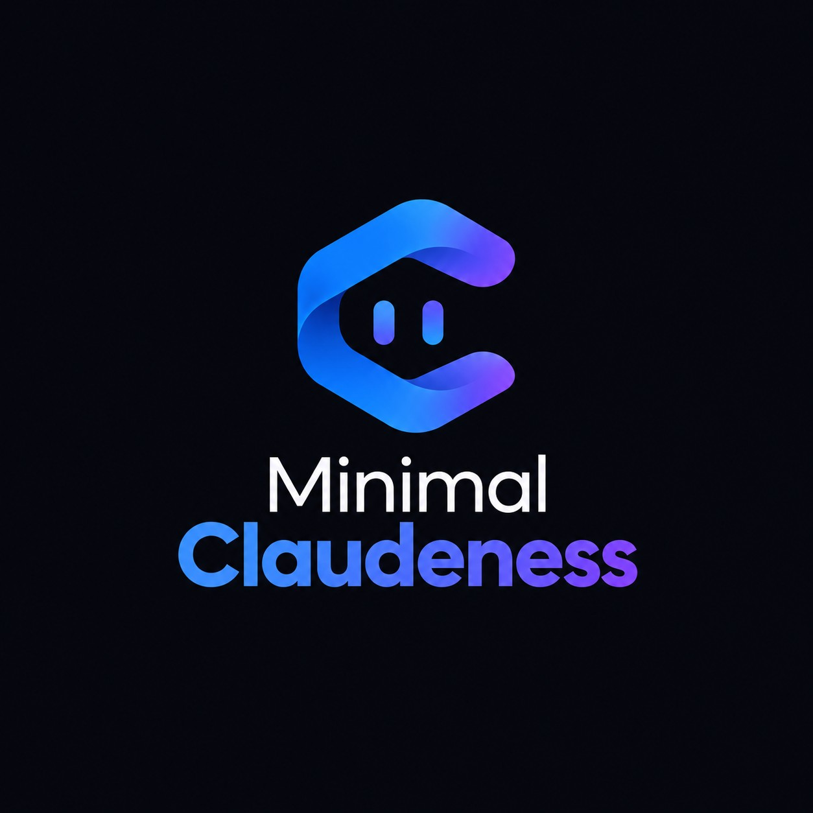

<p align="center">
  
</p>

<h1 align="center">Minimal Claudeness</h1>

<p align="center">
  <em>The essence of working with Claude Code. No dependencies, no noise, no bloat.</em>
</p>

<p align="center">
  
  
  
</p>

<p align="center">
  <a href="#how-to-install"><strong>Install</strong></a> ·
  <a href="#how-to-update"><strong>Update</strong></a> ·
  <a href="#commands"><strong>Commands</strong></a> ·
  <a href="#agents"><strong>Agents</strong></a> ·
  <a href="#the-memory-system"><strong>Memory</strong></a>
</p>

---

A minimal, dependency-free meta-harness for [Claude Code](https://claude.com/claude-code) that gives your projects **structure, memory, and focused subagents** — the things you actually need, and nothing more.

---

> [!WARNING]
> **Early development.** Minimal Claudeness is still under active development.
> Some features may change, break, or behave unexpectedly. Not recommended
> for production use yet — but feedback, issues, and ideas are very welcome.

---

## Why

Every time you start a new project with Claude, you repeat the same context. Every session, you re-explain the stack. Every feature, you risk duplicating something you already built three months ago.

**Minimal Claudeness fixes that.** One harness, cloned into any project, that bootstraps itself, remembers what you have built, and keeps Claude focused.

No Python. No Node. No SQLite. Just files.

---

## Who is this for

- Solo developers who want structure without ceremony.
- Small teams who need shared context and memory.
- Non-programmers building apps with Claude and tired of repeating themselves.
- Anyone who has ever asked Claude "did we already build this?"

---

## What you get

- 🧠 **Two-tier memory** — A searchable ledger of every feature you have built, with automatic archival when it grows.
- 🌿 **Branch per feature** — Each feature lives on its own branch, keeping `main` clean and the history traceable.
- 📋 **Temporary checklists** — Complex features get a `CHECKLIST.md` that fills the memory as tasks are completed, then disappears.
- 🤖 **Focused subagents** — Code reviewer, security auditor, and QA engineer, invoked only when you ask for them.
- 📐 **Modular rules** — Code style, conventions, and testing live in their own files, loaded on demand.
- 🏗️ **Project structure** — A living map of your project, kept up to date.
- 🎨 **Design system slot** — Drop your design guide in, and Claude respects it.
- 🚀 **Self-configuring** — First session detects it is unconfigured and starts the setup automatically.
- 🔒 **Personal overrides** — Keep your own preferences private, never committed.
- 🧱 **Harness-owned core** — `CLAUDE.md` is infrastructure. It is never edited by the user. Project context lives in `OVERVIEW.md` and `STACK.md`.

---

## Structure

```
your-project/
├── CLAUDE.md                  # Harness infrastructure (never edit)
├── OVERVIEW.md                # What the project is (committed)
├── STACK.md                   # Tech stack (committed)
├── DESIGN.md                  # Design system (committed, optional)
├── STRUCTURE.md               # Project map (committed)
├── harness-verified.json      # Setup state flag
├── harness-manifest.json      # Harness version and file list
├── CHECKLIST.md               # Temporary, per-feature (gitignored)
├── .gitignore                 # Excludes personal files
├── .claude/
│   ├── settings.json          # Shared permissions (committed)
│   ├── settings.local.json    # Personal permissions (gitignored)
│   ├── custom-instructions.md # Project-wide custom rules (committed)
│   ├── personal-instructions.md  # Your preferences (gitignored)
│   ├── agents/
│   │   ├── code-reviewer.md
│   │   ├── security-auditor.md
│   │   └── qa-engineer.md
│   ├── commands/
│   │   ├── setup-harness.md
│   │   ├── find-feature.md
│   │   ├── compact-features.md
│   │   ├── review-code.md
│   │   ├── audit-security.md
│   │   └── qa-automation.md
│   ├── rules/
│   │   ├── code-style.md
│   │   ├── conventions.md
│   │   ├── testing.md
│   │   ├── features-format.md
│   │   └── git.md
│   └── skills/
│       └── personal-instructions/
└── memory/
    ├── FEATURES.md            # Active memory (last ~100 features)
    └── FEATURES-HISTORY.md    # Archived features
```

### What gets committed and what does not

| File | Committed? | Why |
|------|------------|-----|
| `CLAUDE.md` | ✅ Yes | Harness infrastructure |
| `OVERVIEW.md`, `STACK.md` | ✅ Yes | Shared project context |
| `DESIGN.md`, `STRUCTURE.md` | ✅ Yes | Shared project docs |
| `.claude/rules/*` | ✅ Yes | Shared project rules |
| `.claude/custom-instructions.md` | ✅ Yes | Shared project instructions |
| `.claude/personal-instructions.md` | ❌ No | Personal preferences |
| `.claude/settings.local.json` | ❌ No | Personal permissions |
| `CHECKLIST.md` | ❌ No | Temporary, per-feature |
| `memory/*` | ✅ Yes | Shared feature memory |

---

## How to install

### Recommended: ask Claude

The easiest way. Open Claude Code in your project and paste this prompt:

```
Install Minimal Claudeness in this project.
Docs: https://github.com/Mathiew82/minimal-claudeness
```

Claude will read the docs, clone the harness, copy the files into your
project, and run the setup. No manual steps.

### Manual install

If you prefer to do it yourself, follow the steps below.

Make sure your project folder already exists before running these commands.
These commands copy the harness files into your project. If any file has
the same name as an existing one, the harness version replaces it — this
is the expected behavior. Minimal Claudeness comes with its own structure
and conventions, and files with reserved names (`CLAUDE.md`, `OVERVIEW.md`,
`STACK.md`, `DESIGN.md`, `STRUCTURE.md`, `harness-verified.json`,
`harness-manifest.json`) are managed by the harness.

**Step 1 — Clone the harness:**

```bash
git clone https://github.com/Mathiew82/minimal-claudeness.git
```

**Step 2 — Copy the harness files into your project:**

<details open>
<summary>Linux / macOS</summary>

```bash
cd minimal-claudeness
rsync -av --exclude='.git' --exclude='README.md' --exclude='LICENSE' --exclude='.github' --exclude='.gitignore' . ../your-project/
cat .gitignore >> ../your-project/.gitignore
cd ..
```
</details>

<details open>
<summary>Windows (PowerShell)</summary>

```powershell
cd minimal-claudeness
$exclude = @('.git', 'README.md', 'LICENSE', '.github', '.gitignore')
Get-ChildItem -Force | Where-Object { $exclude -notcontains $_.Name } | Copy-Item -Destination "..\your-project\" -Recurse -Force
if (-not (Test-Path "..\your-project\.gitignore")) { New-Item -Path "..\your-project\.gitignore" -ItemType File -Force }
Add-Content -Path "..\your-project\.gitignore" -Value (Get-Content ".gitignore")
cd ..
```
</details>

**Step 3 — Clean up:**

Once the files are copied, you can safely delete the `minimal-claudeness`
folder — you no longer need it.

```bash
rm -rf minimal-claudeness                               # Linux / macOS
Remove-Item -Path "minimal-claudeness" -Recurse -Force  # Windows (PowerShell)
```

### Activate

Once the harness files are in your project, open Claude Code inside it
and send a simple message. Any message works — the harness activates on
your first message. `hi harness` is just a friendly convention.

On the first message, Minimal Claudeness will automatically detect that
it is not configured and start the setup. You will see:

```
⌛ Minimal Claudeness is being configured...
```

Then it will:
- Analyze your project.
- Fill in `OVERVIEW.md` and `STACK.md` (if the project has content).
- Generate `STRUCTURE.md` from your directory tree.
- Create `.claude/personal-instructions.md` and `.claude/custom-instructions.md` for you.
- Ensure your `.gitignore` has the three required lines.
- Mark the harness as verified.
- Show you what is available.

No confirmation needed. Just open Claude Code and say hi.

### Work normally

Before implementing a feature, Claude reads `memory/FEATURES.md` and checks if something similar already exists. If it does, it stops and asks.

For meaningful features, Claude creates a `feature/<short-name>` branch and a temporary `CHECKLIST.md`. As tasks are completed, they are marked in the checklist and summarized into `memory/FEATURES.md`. When the feature is done, the checklist is deleted and the branch is ready for review.

The active memory never exceeds 100 entries. When a new feature would push the count past 100, the oldest entry is automatically moved to `FEATURES-HISTORY.md`.

---

## How to update

### Recommended: ask Claude

The easiest way. Open Claude Code in your project and paste this prompt:

```
Update Minimal Claudeness in this project.
Docs: https://github.com/Mathiew82/minimal-claudeness
```

Claude will follow the instructions in `.claude/commands/update-harness.md`
and handle the update for you.

### Manual update

If you prefer to do it yourself:

**Step 1 — Clone the latest version:**

<details open>
<summary>Linux / macOS</summary>

```bash
git clone https://github.com/Mathiew82/minimal-claudeness.git
cd minimal-claudeness
rm -rf .git
cd ..
```
</details>

<details open>
<summary>Windows (PowerShell)</summary>

```powershell
git clone https://github.com/Mathiew82/minimal-claudeness.git
cd minimal-claudeness
Remove-Item -Path ".git" -Recurse -Force
cd ..
```
</details>

**Step 2 — Copy only the harness files:**

The list of harness-owned files is in `harness-manifest.json` under
`harness_files`. Copy only those files from the fresh clone into your
project. Do NOT copy `OVERVIEW.md`, `STACK.md`, `DESIGN.md`,
`STRUCTURE.md`, `.claude/rules/code-style.md`, `.claude/rules/conventions.md`,
`.claude/rules/testing.md`, `.claude/settings.json`, or anything under
`memory/`.

<details open>
<summary>Linux / macOS</summary>

```bash
cd minimal-claudeness
rsync -av --exclude='.git' \
  --exclude='README.md' \
  --exclude='LICENSE' \
  --exclude='.github' \
  --exclude='.gitignore' \
  --exclude='OVERVIEW.md' \
  --exclude='STACK.md' \
  --exclude='DESIGN.md' \
  --exclude='STRUCTURE.md' \
  --exclude='.claude/rules/code-style.md' \
  --exclude='.claude/rules/conventions.md' \
  --exclude='.claude/rules/testing.md' \
  --exclude='.claude/settings.json' \
  --exclude='.claude/personal-instructions.md' \
  --exclude='.claude/settings.local.json' \
  --exclude='memory' \
  --exclude='CHECKLIST.md' \
  --exclude='harness-verified.json' \
  . ../your-project/
cd ..
```
</details>

<details open>
<summary>Windows (PowerShell)</summary>

```powershell
cd minimal-claudeness
$exclude = @(
  '.git', 'README.md', 'LICENSE', '.github', '.gitignore',
  'OVERVIEW.md', 'STACK.md', 'DESIGN.md', 'STRUCTURE.md',
  'CHECKLIST.md', 'harness-verified.json'
)
Get-ChildItem -Force | Where-Object { $exclude -notcontains $_.Name } | Copy-Item -Destination "..\your-project\" -Recurse -Force

# Do NOT copy these from .claude/
$excludeClaude = @('code-style.md', 'conventions.md', 'testing.md', 'settings.json', 'personal-instructions.md', 'settings.local.json')
Get-ChildItem -Path ".claude\rules" -Force | Where-Object { $excludeClaude -notcontains $_.Name } | Copy-Item -Destination "..\your-project\.claude\rules\" -Recurse -Force
cd ..
```
</details>

**Step 3 — Clean up:**

<details open>
<summary>Linux / macOS</summary>

```bash
rm -rf minimal-claudeness
```
</details>

<details open>
<summary>Windows (PowerShell)</summary>

```powershell
Remove-Item -Path "minimal-claudeness" -Recurse -Force
```
</details>

**Step 4 — Update the version:**

Edit `harness-manifest.json` and update the `version` field to match the
new release.

---

## Commands

| Command | What it does |
|---------|--------------|
| `/setup-harness` | Configures Minimal Claudeness for a new project. |
| `/update-harness` | Updates the harness to the latest version. |
| `/find-feature <term>` | Searches active memory. |
| `/find-feature --all <term>` | Searches active memory and the archive. |
| `/compact-features` | Archives the oldest entries to history. |
| `/review-code` | Runs the code reviewer subagent. |
| `/audit-security` | Runs the security auditor subagent. |
| `/qa-automation` | Runs the QA engineer subagent. |

---

## Agents

| Agent | Model | When to use |
|-------|-------|-------------|
| `@code-reviewer` | Sonnet | After code changes, before commit. |
| `@security-auditor` | Sonnet | When auth, payments, or user input is involved. |
| `@qa-engineer` | Haiku | When you want types, lint, and tests checked. |

Each agent is **read-only**. None of them modify your files. They report, you decide.

---

## The memory system

Minimal Claudeness uses two files to track what has been built:

**`memory/FEATURES.md`** — Active memory. The most recent ~100 features. Read by Claude before implementing anything new. The file has a counter at the top (`**Count: N / 100**`) that tracks how many entries it contains.

Example entry:

```
## 2024-05-10 - Contact page with form
- **Keywords:** contact, form, smtp, email
- **Files:** src/pages/Contact.tsx, src/api/mail.ts
- **Branch:** feature/contact-form-smtp
```

**`memory/FEATURES-HISTORY.md`** — Archive. Older entries, kept forever, read only when you explicitly ask for it (`/find-feature --all`).

The format is defined in `.claude/rules/features-format.md`.

### Feature workflow

1. **Search** — Claude checks `memory/FEATURES.md` for related work.
2. **Branch** — For meaningful features, Claude creates `feature/<short-name>`.
3. **Checklist** — For complex features, Claude creates a temporary `CHECKLIST.md`.
4. **Implement** — Work happens on the branch, checklist updates as tasks complete.
5. **Record** — Meaningful deliverables are appended to `memory/FEATURES.md` with branch, keywords, and files.
6. **Close** — When done, `CHECKLIST.md` is deleted. The branch is ready for review.

---

## Customization

| File | What to put in it |
|------|-------------------|
| `OVERVIEW.md` | What the project is, who it's for, its purpose. |
| `STACK.md` | Languages, frameworks, versions, key libraries. |
| `DESIGN.md` | Your design system (colors, typography, components). |
| `STRUCTURE.md` | A map of your project structure. |
| `.claude/rules/code-style.md` | Formatting, naming, style rules. |
| `.claude/rules/conventions.md` | Commits, branches, patterns. |
| `.claude/rules/testing.md` | Testing framework, structure, commands. |
| `.claude/rules/features-format.md` | Format for memory entries. |
| `.claude/rules/git.md` | Commit format, branch naming, co-author rules. |
| `.claude/custom-instructions.md` | Project-wide custom instructions (committed). |
| `.claude/personal-instructions.md` | Your personal preferences (gitignored). |

The rules files are empty by default with clear placeholders. Fill them when you need them, not before.

### What NOT to edit

- **`CLAUDE.md`** — Harness infrastructure. Managed by Minimal Claudeness and updated when you update the harness. Do not edit it.
- **`harness-verified.json`** — Managed automatically by the setup.
- **`harness-manifest.json`** — Updated by the update process.

If you want to change project context, edit `OVERVIEW.md` or `STACK.md`.
If you want to add project rules, edit `.claude/rules/` or `.claude/custom-instructions.md`.
If you want personal preferences, edit `.claude/personal-instructions.md`.

---

## Philosophy

- **Minimal.** If it is not necessary, it is not here.
- **No dependencies.** Pure text, pure Git, pure Claude.
- **Explicit over automatic.** You decide when to invoke agents, not the model.
- **Memory that scales.** Two tiers, archived forever, searchable on demand.
- **Traceable work.** Every feature has a branch, a memory entry, and (if complex) a checklist.
- **Clean separation.** Harness files are updated. Project files are yours.
- **Yours.** Personal instructions stay private, project rules stay shared.

> Claude Code is powerful on its own. Minimal Claudeness just gives it a place to think.

---

## Contributing

Found a bug? Have an idea? Open an issue or a PR.

If you build something cool with Minimal Claudeness, I want to hear about it.

---

<p align="center">
  <strong>Minimal Claudeness</strong><br>
  <em>The essence of working with Claude Code.</em>
</p>
